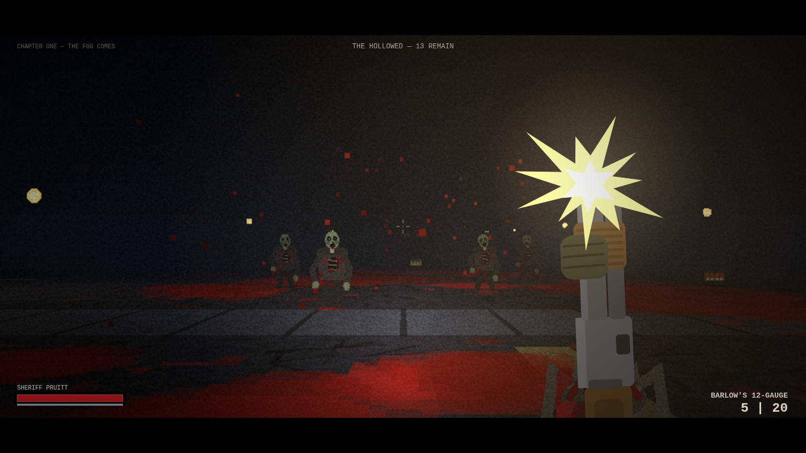
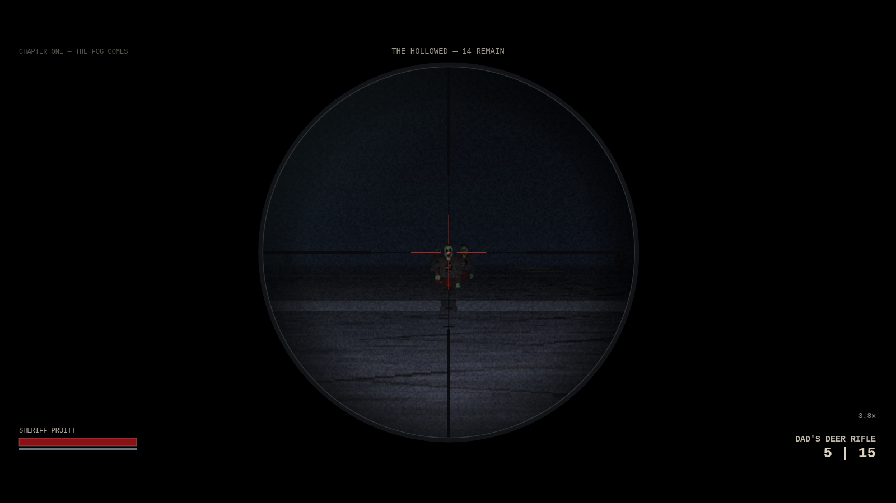
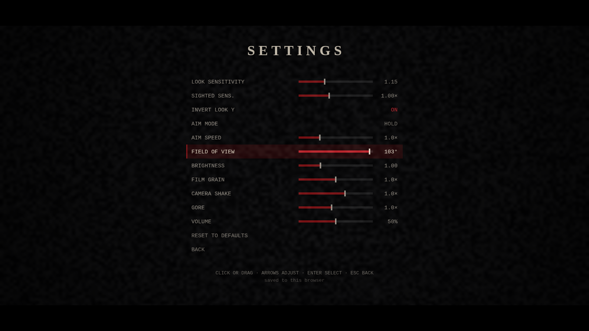
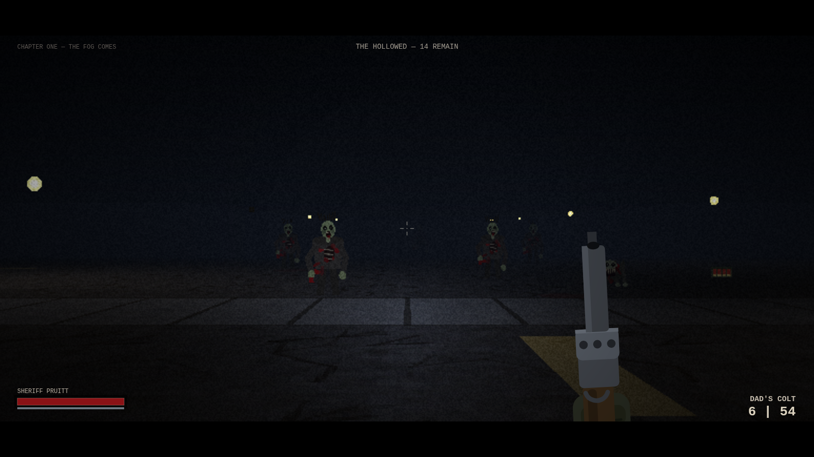
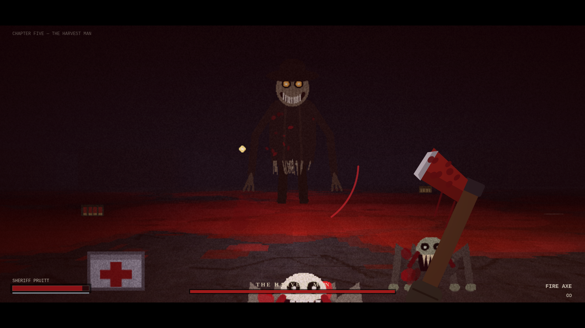

# HARROW'S END

*every small town keeps a harvest*


**Harrow's End, Maine — population 1,406 — October 1986.** The fog rolled off
Miller's Pond at 3:11 AM, thick as wet wool. By 3:15 the phones were dead. By
3:20 the screaming started. Sheriff Dana Pruitt loaded the revolver her father
left her, picked up the flashlight, and stepped out onto Main Street.

A first-person survival horror shooter in the spirit of a certain Maine
paperback author — five chapters of fog, flickering streetlights, typewriter
narration, and a truly indecent amount of blood and guts. Every drop of blood,
every gib, and every corpse stays on the street for the whole night.



Right-click brings the sights up — irons on the Colt and the twelve-gauge, and
3.8× of glass on your father's deer rifle.



## Play it

No build, no dependencies. Clone and open `index.html` in any modern desktop
browser — or serve it locally:

```
python3 -m http.server 8000
# then visit http://localhost:8000
```

Desktop browser with a mouse. Click once to grab the flashlight (pointer lock)
and to let the browser start the audio.

## Controls

| Input | Action |
|---|---|
| `WASD` | Move / strafe |
| Mouse | Look (click to lock; `Esc` releases) |
| Left click | Fire |
| **Right click** | **Aim down sights** (hold) |
| `Shift` | Sprint (stamina) |
| `R` | Reload |
| `1` / `2` / `3` / `4` or wheel | Dad's Colt · Barlow's 12-gauge · Dad's deer rifle · fire axe |
| Arrow keys | Turn and look, if you'd rather not use the mouse |
| `Esc` / `P` | Intermission |
| `O` | Settings (from the title screen or the intermission) |
| `M` | Mute · `F` fullscreen |

## Settings

Press `O` on the title screen or at the intermission. Click and drag the
sliders, or use the arrow keys. Everything is saved to your browser.



Look sensitivity · sighted sensitivity (an extra multiplier that only applies
while aiming, for taming the 3.8× scope) · invert Y · aim mode (hold or
toggle) · aim speed · field of view · brightness · film grain · camera shake ·
gore · volume.

If the night is too dark to read on your monitor, or the sights come up too
slowly, or you want the blood dialled up past what I shipped — that's what
these are for.



## The night ahead

1. **THE FOG COMES** — the Hollowed shuffle out of the fog.
2. **THE CRAWLING KIND** — some of them move low and fast now. A twelve-gauge
   is lying on the sidewalk in a duffel bag.
3. **WHAT THE DRAINS KEEP** — the swollen ones detonate into acid and viscera.
   Keep your distance. Your father's scoped deer rifle is waiting where you
   left it.
4. **THE CONGREGATION** — all of Main Street at once.
5. **THE HARVEST MAN** — taller than the streetlights, smiling. Bait his charge
   into a storefront and put the axe in him while he's down.

Survive the night and a second, endless shift opens: **NIGHTMARE SHIFT**.



## What's under the hood

Two files, zero dependencies, everything procedural — no art assets, no audio
files, no engine.

- **`engine.js`** — a raycasting renderer written from scratch: DDA textured
  walls, per-pixel floor casting, billboard sprites with a depth buffer, a
  baked lamp lightmap, and distance fog. The town, its wall/floor textures and
  every creature frame are generated in code at load time.
- **`game.js`** — camera, weapons, AI, the director, the chapter script and the
  film grade.
- **Aim down sights**: holding right click raises the weapon to eye level,
  narrows the camera FOV, scales mouse sensitivity with the zoom so aiming
  stays proportional, tightens the group to a fifth of hip spread, steadies the
  bob and slows your feet. The flashlight beam is angular rather than
  screen-space, so zooming spreads it across more of the frame instead of
  leaving you staring into a black tube.
- **The deer rifle**: bolt-action, 3.8× duplex scope with an illuminated
  centre, and enough behind the round to punch through two of them and kill the
  one standing behind.
- **Persistent gore** lives in a blood-decal layer sampled during floor
  casting: spray, pools, smears, bone, shell casings and corpses are stamped
  into the world and never despawn. By chapter four Main Street is a charnel
  house of everything you've done all night.
- **Film look**: letterboxing, animated grain, vignette, cold night grade,
  lightning storms, screen shake, slow-motion multi-kills, typewriter chapter
  cards, and blood on the lens when something reaches you.
- **Audio** is entirely WebAudio-synthesized — dread drone, wind, thunder,
  gunshots, wet squelches, and a heartbeat when you're nearly done.

The grade and the grain are folded into the raycaster's own per-pixel math
rather than composited over the frame; done the obvious way they cost more
than the entire renderer.

**Content note:** heavy stylized blood and gore. It says so on the poster.
