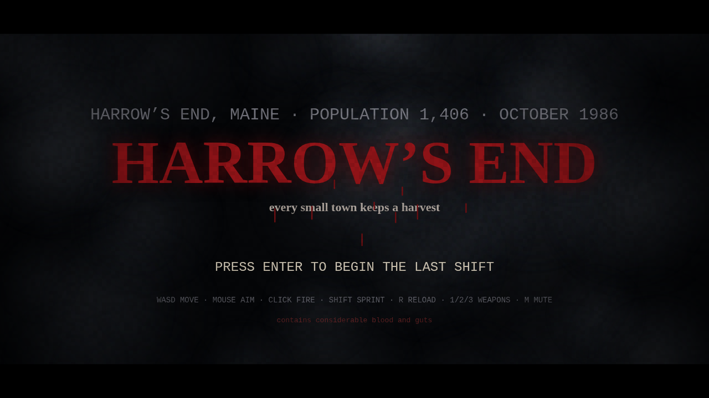
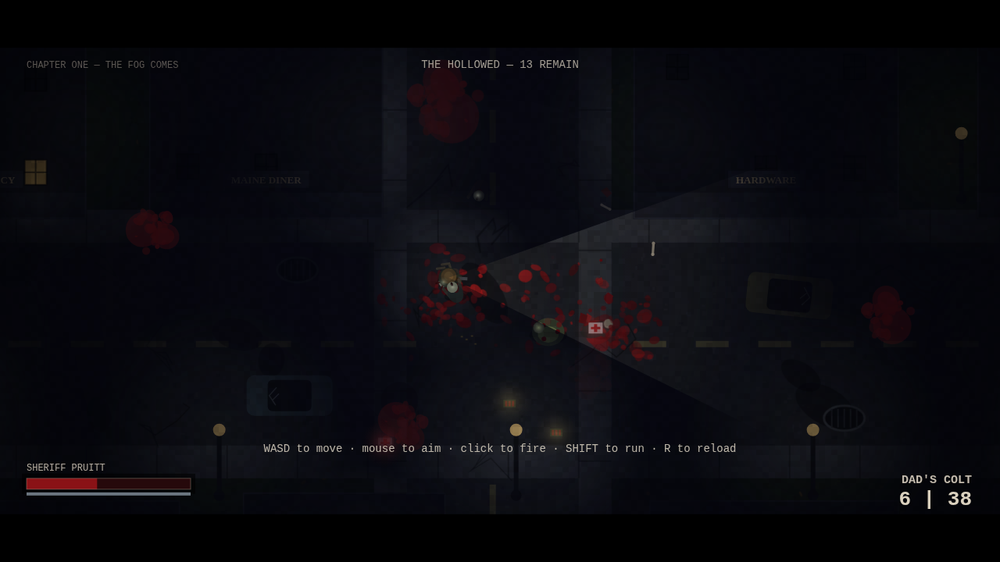
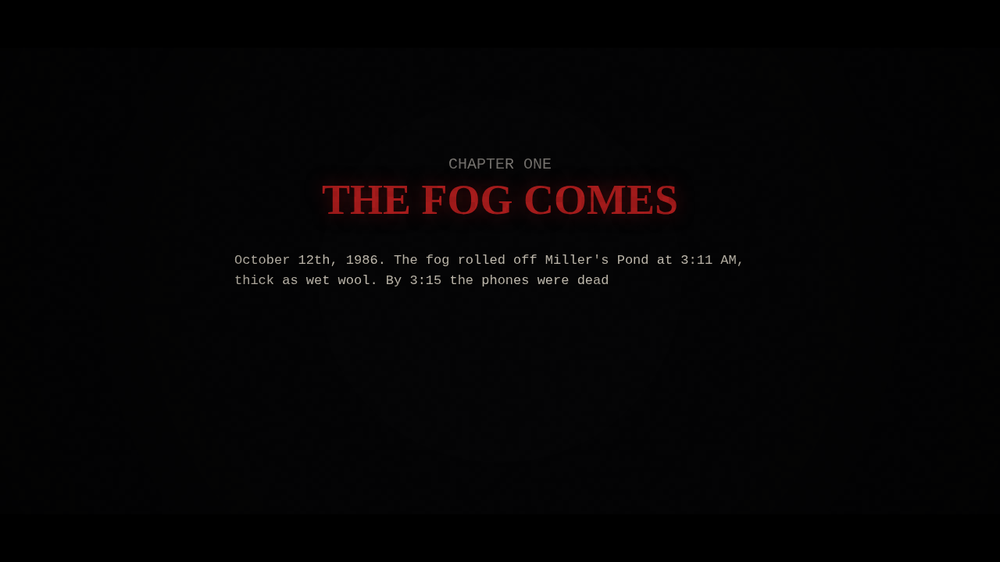

# HARROW'S END

*every small town keeps a harvest*



**Harrow's End, Maine — population 1,406 — October 1986.** The fog rolled off
Miller's Pond at 3:11 AM, thick as wet wool. By 3:15 the phones were dead. By
3:20 the screaming started. Sheriff Dana Pruitt loaded the revolver her father
left her, picked up the flashlight, and stepped out onto Main Street.

A cinematic small-town survival horror in the spirit of a certain Maine
paperback author — five chapters of fog, flickering streetlights, typewriter
narration, and a truly indecent amount of blood and guts. Every drop of blood,
every gib, and every corpse stays on the street for the whole night.



## Play it

No build, no dependencies. Clone and open `index.html` in any modern desktop
browser — or serve it locally:

```
python3 -m http.server 8000
# then visit http://localhost:8000
```

Play in a desktop browser with a mouse. Click once so the browser allows audio.

## Controls

| Input | Action |
|---|---|
| `WASD` / arrows | Move |
| Mouse | Aim the flashlight |
| Left click | Fire |
| `Shift` | Sprint (stamina) |
| `R` | Reload |
| `1` / `2` / `3` or wheel | Dad's Colt · Barlow's 12-gauge · fire axe |
| `Esc` / `P` | Intermission |
| `M` | Mute · `F` fullscreen |

## The night ahead

1. **THE FOG COMES** — the Hollowed shuffle out of the fog.
2. **THE CRAWLING KIND** — some of them move low and fast now. A twelve-gauge
   is lying on the sidewalk in a duffel bag.
3. **WHAT THE DRAINS KEEP** — the swollen ones detonate. Keep your distance.
4. **THE CONGREGATION** — all of Main Street at once.
5. **THE HARVEST MAN** — taller than the streetlights, smiling. Bait his
   charge into a storefront and hit him while he's down.

Survive the night and a second, endless shift opens: **NIGHTMARE SHIFT**.



## What's under the hood

- Single `game.js`, zero dependencies — everything is procedural: the town,
  the monsters, the lighting, and every sound (WebAudio-synthesized drone,
  wind, thunder, gunshots, squelches, and a heartbeat when you're nearly done).
- Film look: letterboxing, animated grain, vignette, night-blue grade,
  lightning strikes, screen shake, slow-motion multi-kills, typewriter
  chapter cards.
- Real flashlight: a cone of light cut out of the darkness, plus flickering
  streetlamps, lit windows, and muzzle flashes that light up the street.
- Persistent gore: blood spray, pools, smears, shell casings, bones, and
  corpses are stamped onto the world and never despawn.

**Content note:** heavy stylized blood and gore. It says so on the poster.
